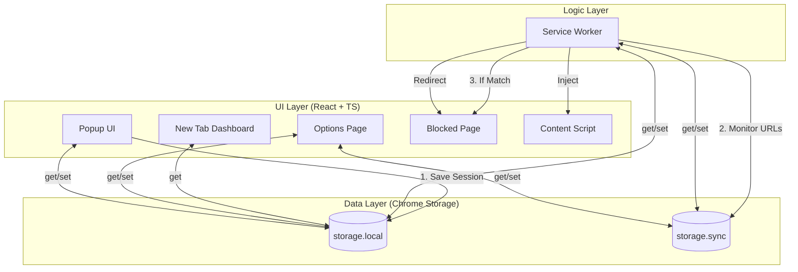

# 🧩 Productivity++ - Chrome Extension

A multi-feature productivity extension built with React, TypeScript, and Webpack using Manifest V3.

## ✨ Features

- **Tab Session Manager**: Save current window tabs as a named session and restore them later in a new window.
- **Note-Taking**: Persistent notes with markdown support, accessible from the popup and New Tab page.
- **Website Blocker**: Block distracting websites by hostname. Managed via the Options page.
- **New Tab Override**: A custom dashboard with a clock and widgets for your notes and recent sessions.
- **Context Menu**: Right-click on any page to "Add page to notes".
- **Export and Import Data(Added as Bonus on personal choice)**: Export and import data from the extension.
- **Keyboard Shortcuts**: 
  - `Alt+Shift+Q`: Open Popup
  - `Ctrl+Shift+S`: Quick-save current tabs as a session

## 🏗️ Architecture & Workflow

The extension uses a distributed architecture where UI components interact with a centralized storage layer, and a service worker handles background events and logic.



### 🔄 Function Workflows (Technical)

#### 1. Extension Loading & Data Initialization
- When the browser starts, the **Service Worker** registers and creates the Context Menu.
- All stored data (sessions, notes, blocklist) persists in Chrome's internal storage engine.

#### 2. End-to-End Operation
- **User Action**: Saving a Note.
  - **Frontend**: The `NoteTaker` component writes to `chrome.storage.local`.
  - **Persistence**: This is immediate and global (shared across popup and New Tab).
  - **New Tab Dashboard**: The next time you open a New Tab, the dashboard reads this key and displays the updated text.
- **User Action**: Saving a Session.
  - **Frontend**: `TabSessions` captures current URLs.
  - **Storage**: Added to the `sessions` object in local storage.
  - **Verification**: You can restore this from the Popup OR the New Tab sessions widget.
- **User Action**: Data Portability.
  - **Export**: Generates `productivity_suite_export.json` with all settings.
  - **Import**: Allows restoring all data from a JSON file (includes schema validation).

#### 3. Background Logic (Website Blocker)
- Whenever a tab URL changes, Chrome notifies the **Service Worker**.
- The worker runs a quick hostname check (using the synced blocklist).
- If blocked, it commands the tab to navigate to the extension's **Blocked Page** (`blocked.html`).

---

---

## 🛠️ Chrome APIs Used

This project leverages several core Chrome APIs to deliver its features:

- **`chrome.storage`**: Used for persistent data storage. `local` is used for sessions and notes, while `sync` ensures the website blocklist follows the user across devices.
- **`chrome.tabs`**: Allows the extension to query active tabs for session saving and monitor URL changes for the website blocker.
- **`chrome.commands`**: Handles the registration and execution of global keyboard shortcuts (`Alt+Shift+Q` and `Ctrl+Shift+S`).
- **`chrome.windows`**: Enables the creation of new browser windows when restoring a saved tab session.
- **`chrome.contextMenus`**: Powers the "Add page to notes" right-click feature, allowing seamless data capture.
- **`chrome.runtime`**: Manages internal messaging between the popup, options page, and background service worker.

---

## 📖 Usage Guide

### 📂 Tab Session Manager
1.  Open the extension popup (**Alt+Shift+Q**).
2.  In the **Sessions** tab, enter a name for your current work (e.g., "Research").
3.  Click **Save**.
4.  To restore, find your session in the list and click **Restore**. This will open all saved tabs in a new window.
5.  *Quick Tip*: Use **Ctrl+Shift+S** to auto-save your current tabs without opening the popup!

### 📝 Note-Taking
1.  Navigate to the **Notes** tab in the popup.
2.  Type your thoughts or copy-paste information.
3.  Click **Save Notes**.
4.  Open a **New Tab** to see a preview of your notes in the dashboard.
5.  *Quick Tip*: Right-click anywhere on a webpage and select **"Add page to notes"** to quickly save the current URL and title!

### 🚫 Website Blocker
1.  Click the **Options** button in the popup navigation (or right-click the extension icon and select **Options**).
2.  In the **Website Blocker** section, enter the hostname you want to block (e.g., `twitter.com`).
3.  Click **Block**.
4.  Try navigating to that site; you will be redirected to the **Page Blocked** dashboard.
5.  To unblock, click **Remove** next to the hostname in Settings.

### 📤 Data Backup (Export)
1.  Go to the **Settings (Options)** page.
2.  Scroll to **Data Portability**.
3.  Click **Export All Data**. A file named `productivity_suite_export.json` will be downloaded.

---

## 🛠️ Setup & Installation

1. **Install Dependencies**:
   ```bash
   npm install
   ```

2. **Build the Project**:
   ```bash
   npm run build
   ```
   This generates a `dist/` directory containing the bundled extension.

3. **Load in Chrome**:
   - Open Chrome and navigate to `chrome://extensions`.
   - Enable **Developer mode** (toggle in the top right).
   - Click **Load unpacked**.
   - Select the `dist/` folder in this project directory.

## 📁 Project Structure

A comprehensive breakdown of the project's organization:

- **`manifest.json`**: The core configuration file defining permissions, background scripts, and UI entry points.
- **`webpack.config.js`**: Orchestrates the build process, bundling TypeScript/React and copying assets to `/dist`.
- **`public/`**: Contains HTML templates for the popup, options, new tab, and blocked pages.
- **`src/`**: The main source code directory.
  - **`background/`**: Event-driven Service Worker logic (Context Menu, Command handling).
  - **`content/`**: Content scripts for specialized page interactions (Blocker messaging).
  - **`newtab/`**: React components and styles for the New Tab dashboard.
  - **`options/`**: UI for settings, website blocking, and data portability.
  - **`popup/`**: The main extension interface for sessions and notes.
  - **`shared/`**: Unified API for storage, shared types, and constants.
  - **`styles/`**: Global CSS tokens, variables, and common styles.
- **`dist/`**: (Generated) The production-ready extension package to be loaded into Chrome.

---

## ❓ Frequently Asked Questions

**Q: Is the restore behavior (opening in a new window) intentional?**
A: **Yes.** As per the requirements of task, saved sessions are restored into a completely new browser window to keep your work environments separate.

**Q: Are notes global?**
A: **Yes.** Notes are designed as a single, persistent scratchpad that stays the same regardless of what session you are in. This allows you to have a continuous thread of thoughts across different task contexts.

**Q: Why doesn't the extension "replace" or change my current webpage when I save a note?**
A: To maintain user privacy and security, the extension operates in its own sandboxed UI (the popup and new tab). It only interacts with current webpages via the **Context Menu** (to grab info) or the **Blocker** (to prevent access).

---

## 🔒 Privacy & Data

All data (notes, sessions, blocked sites) is stored locally using `chrome.storage.local` and `chrome.storage.sync`. No data is sent to external servers. Use the **Export Data** button in Settings to download a JSON backup of your data.
